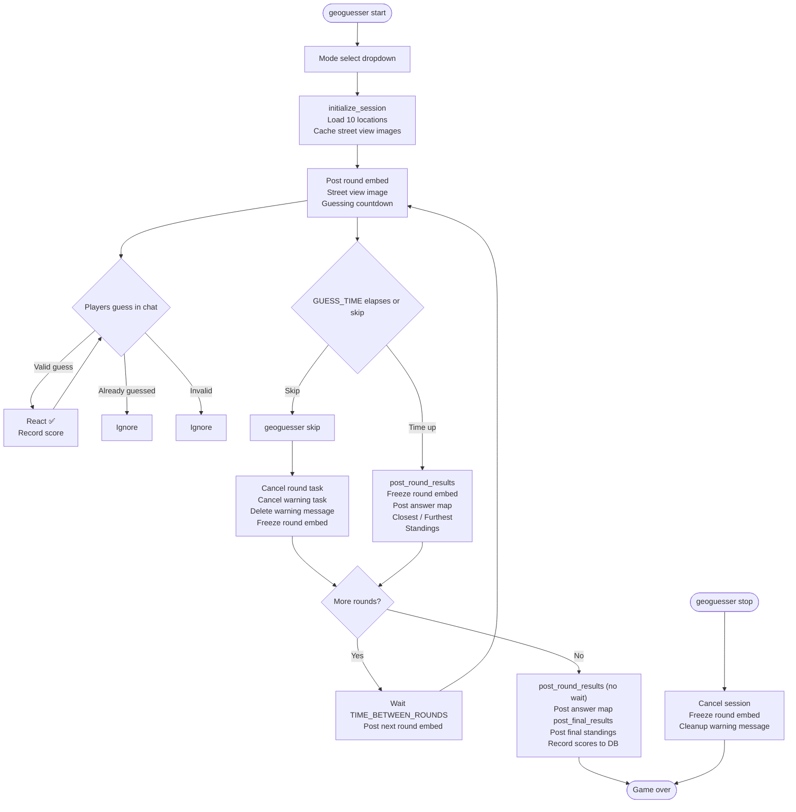

# GeoGuesser

A Lancaster-themed GeoGuesser game playable in Discord. Each round shows a Google Street View image and players guess the location by typing in chat. Closer guesses earn more points.

## Commands

| Command | Description |
|---|---|
| `/geoguesser start` | Start a new session. Prompts for mode then rounds (capped by available locations). |
| `/geoguesser stop` | Stop the current session (host only). |
| `/geoguesser skip` | Skip the current round (host only). |
| `/geoguesser leaderboard [period]` | Show the guild leaderboard. Period: `all` (default), `today`, `week`. |
| `/geoguesser stats` | Show location counts and games recorded (bot owner only). |
| `/geoguesser populate` | Populate the database with locations (bot owner only). |
| `/geoguesser wipe` | Wipe all locations for a mode (bot owner only). |
| `/geoguesser clearsessions` | Clear all active and starting sessions (bot owner only). |

## Modes

- **Lancaster City** — guesses are snapped to Lancaster City, PA
- **Lancaster County** — guesses are snapped to Lancaster County, PA

## Game Flow

## Scoring

Score per round = **distance score** + **time bonus**

| Component | Formula | Max |
|---|---|---|
| Distance score | `max(0, 1 - meters / mode_radius) * 100` | 100 pts |
| Time bonus | `seconds remaining when guess is submitted` | 20 pts |
| **Total** | | **120 pts** |

- Distance is straight-line (haversine), not driving distance
- Score radius: Lancaster City = 2,000m (0 pts at 2km+), Lancaster County = 20,000m (0 pts at 20km+)
- Generation radius (used for picking random locations): City = 10km, County = 30km
- Time bonus rewards faster guesses — copy-cats who submit the same location later get fewer points
- Scores accumulate across all rounds

At game end, if 2+ players participated, scores are recorded to the `geoguesser_game_results` table for persistent leaderboards. Results are versioned (`scoring_version`) so leaderboards remain comparable if the formula changes.

## Configuration

| Constant | Default | Description |
|---|---|---|
| `GUESS_TIME` | 20s | Time allowed per round |
| `WARNING_TIME` | 10s | When the half-time warning fires |
| `TIME_BETWEEN_ROUNDS` | 10s | Delay between rounds |
| Default rounds | 10 | Selected interactively after mode pick, capped by available locations |

## Database

| Table | Purpose |
|---|---|
| `geoguesser_locations` | Pre-populated Street View locations with coordinates and reverse-geocoded labels |
| `geoguesser_game_results` | Per-player per-game scores for persistent leaderboards |

## Development Notes

- Locations must be pre-populated via `/geoguesser populate` before games can start
- Street view images are cached to disk under `data/GeoGuesser/streetview_cache/`
- Session state (`_active_sessions`, `_sessions_starting`) is stored at module level and survives hot-reloads but not full bot restarts
- All Google Maps API calls (geocoding, snap-to-roads, street view) are run via `asyncio.to_thread` to avoid blocking the event loop
